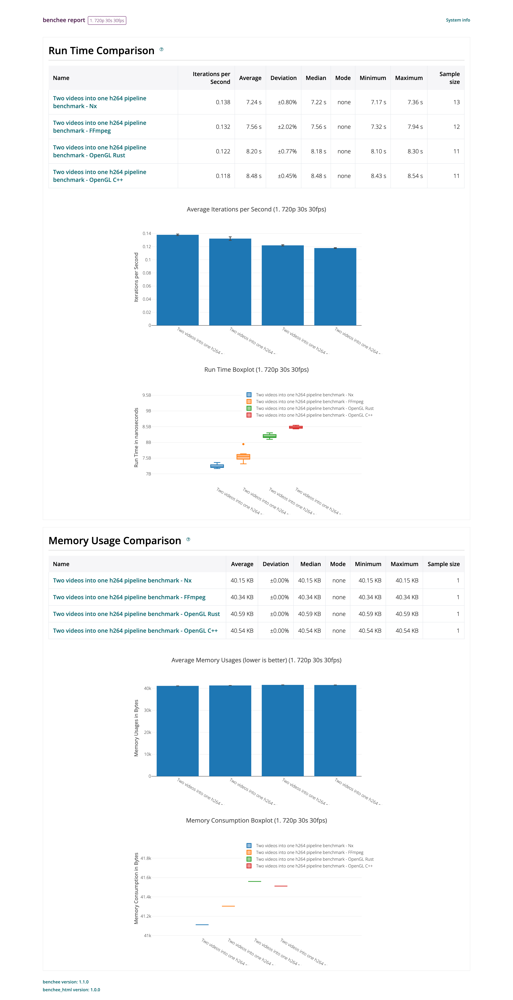
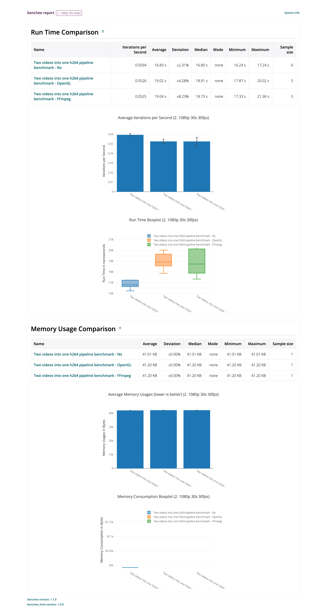
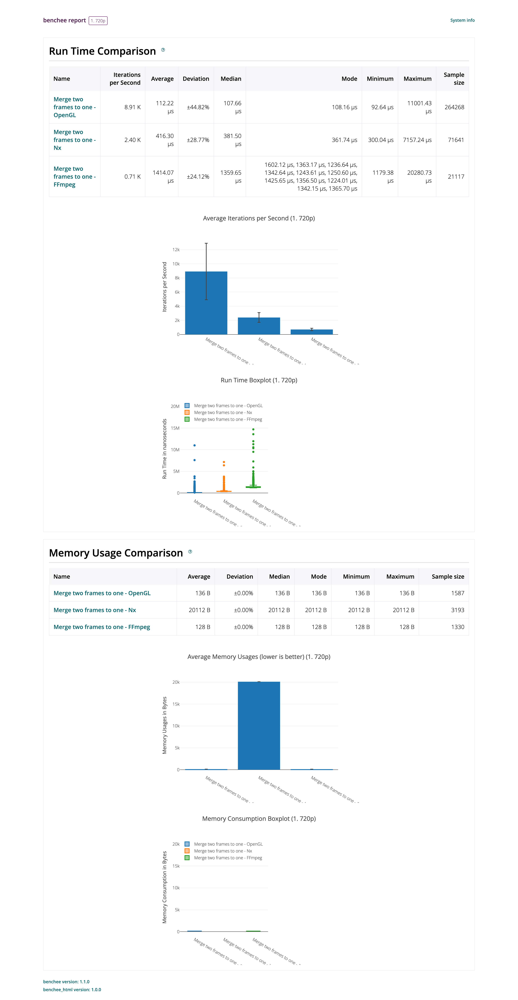
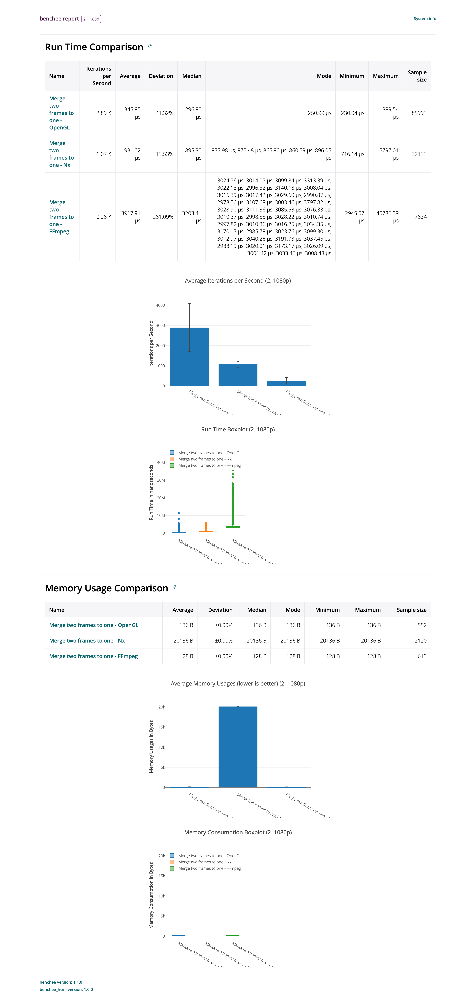
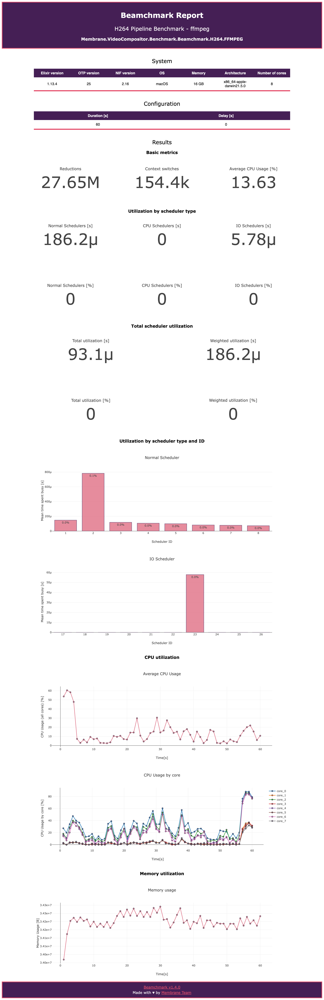
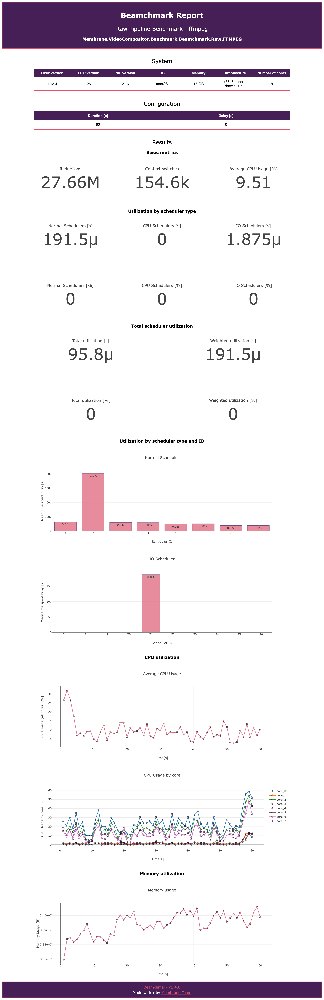

# Benchmarks for Membrane Video Compositor Plugin

## Current benchmarks

1. Benchee (run time and memory usage benchmarks):
    - h264 pipeline benchmark ```lib\benchee\h264_pipeline.exs```
    - raw pipeline benchmark ```lib\benchee\raw_pipeline.exs```
    - merge frames benchmark ```lib\benchee\merge_frames.exs```
2. Beamchmark (reductions / context switches / cpu and memory usage / schedulers):
    - h264 pipeline benchmark ```lib\beamchmark\h264_pipeline.exs```
    - raw pipeline benchmark ```lib\beamchmark\raw_pipeline.exs```
## How to run benchmarks:

1.  Enter benchmark folder ```cd benchmark```
2.  Run ```mix deps.get``` command
3.  Run command for benchmarks:
    1. For running packs of benchmarks:
        - for all benchmarks (estimated total run time - 27min 30s): ```mix run benchmark.exs```
        - for benchee benchmarks (estimated total run time - 24min 30s): ```mix run benchmark.exs benchee```
        - for beamchmark benchmarks (estimated total run time - 3min): ```mix run benchmark.exs beamchmark```
    2. For running single benchmarks:
        - benchee benchmarks: 
            - for measuring frame composition performance (estimated total run time - 9min 40s): ```mix run lib/benchee/merge_frames.exs```
            - for measuring raw pipeline performance (estimated total run time - 9min 40s): ```mix run lib/benchee/raw_pipeline.exs```
            - for measuring h264 pipeline performance (estimated total run time - 5min 10s): ```mix run lib/benchee/h264_pipeline.exs```
        - beamchmark benchmarks:
            - for measuring raw pipeline performance (estimated total run time - 3min): ```mix run lib/beamchmark/raw_pipeline.exs```
            - for measuring h264 pipeline performance (estimated total run time - 3min): ```mix run lib/beamchmark/h264_pipeline.exs```
4. Results will be displayed in console log and saved in html website saved at "results" directory

## How to modify test length:

1. Benchee: </br>
    - Modify parameters in ```Benchee.run()``` function:
        - ```warmup``` for time of benchmark warmup
        - ```time``` for time of pipeline performance measurement
        - ```memory_time``` for time of pipeline memory usage measurement
2. Beamchmark: </br>
    - Modify ```benchmark_duration``` parameter in ```benchmarks_options``` map.

## Example benchmarks results:

<h3 align="center"> Benchee pipelines results: </h3>

720p                       |  1080p
:-------------------------:|:-------------------------:
 | 

<h3 align="center"> Benchee merge two frames results: </h3>

720p                       |  1080p
:-------------------------:|:-------------------------:
 | 


<h3 align="center"> Beamchmark pipelines ffmpeg results: </h3>

h264 pipeline             |  raw pipeline
:-------------------------:|:-------------------------:
 | 
