# Benchmarks for Membrane Video Compositor Plugin

## Current benchmarks

1. Benchee (run time and memory usage benchmarks):
    - h264 pipeline benchmark `lib\benchee\h264_pipeline.exs`
    - raw pipeline benchmark `lib\benchee\raw_pipeline.exs`
    - merge frames benchmark `lib\benchee\merge_frames.exs`
## How to run benchmarks:

1.  Enter benchmark folder `cd benchmark`
2.  Run `mix deps.get` command
3.  Run command for benchmarks:
    1. For running packs of benchee benchmarks: `mix run benchmark.exs`
    2. For running single benchmarks:
        - for measuring frame composition performance: `mix run lib/benchee/merge_frames.exs`
        - for measuring raw pipeline performance: `mix run lib/benchee/raw_pipeline.exs`
        - for measuring h264 pipeline performance: `mix run lib/benchee/h264_pipeline.exs`
4. Results will be displayed in console log and saved in html website saved at "results" directory

## How to modify test length:

- Modify parameters in `Benchee.run()` function:
    - `warmup` for time of benchmark warmup
    - `time` for time of pipeline performance measurement
    - `memory_time` for time of pipeline memory usage measurement

## Example benchmarks results:
### Lenovo Legion i7-11800H, 32GB RAM, RTX 3050 Ti

<h3 align="center"> Benchee merge two frames results: </h3>

720p                       |  1080p                    |  4k
:-------------------------:|:-------------------------:|:-------------------------:
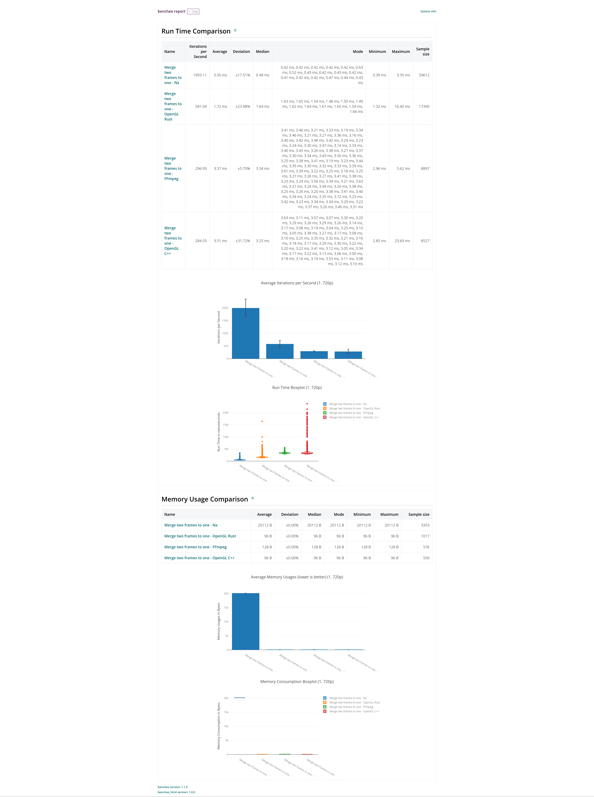 | 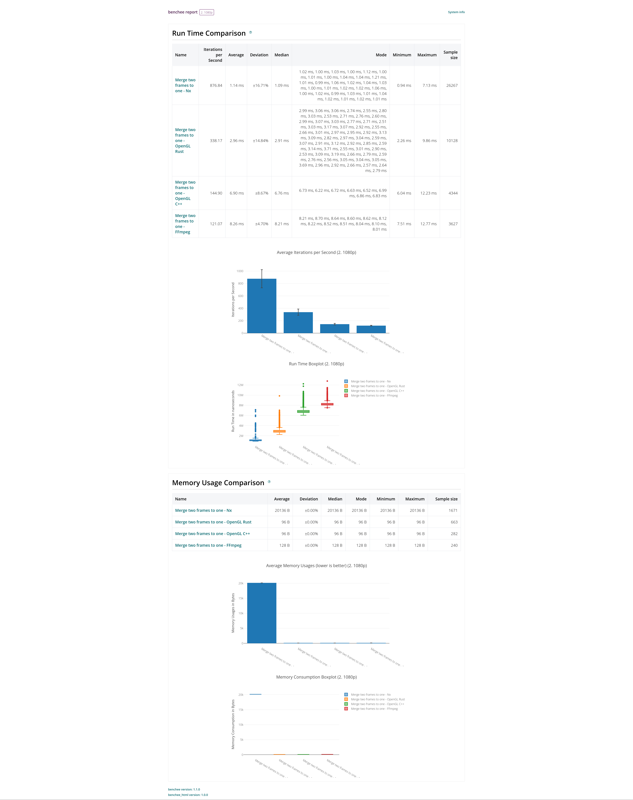 | 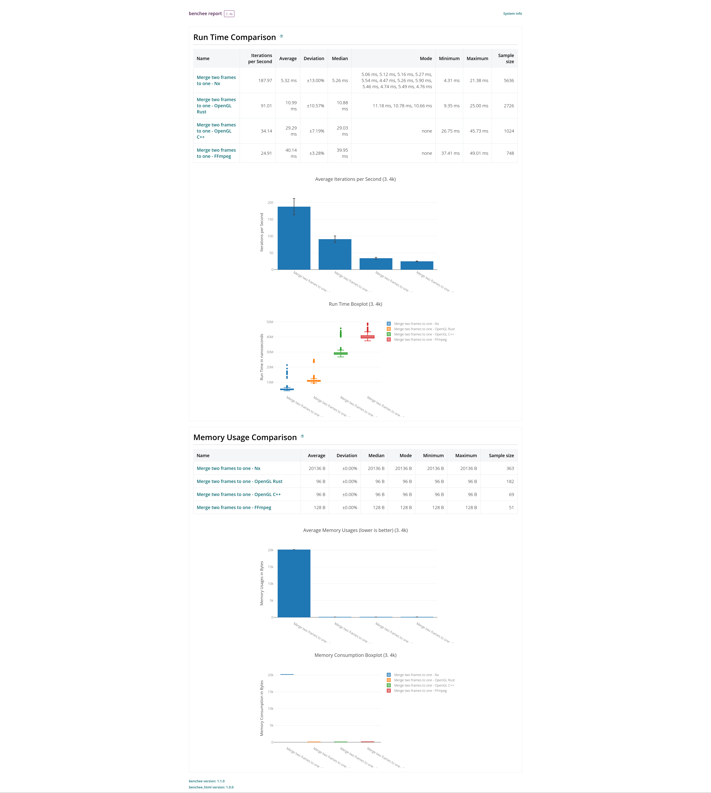

<h3 align="center"> Benchee h264 pipeline results: </h3>

720p                       |  1080p
:-------------------------:|:-------------------------:
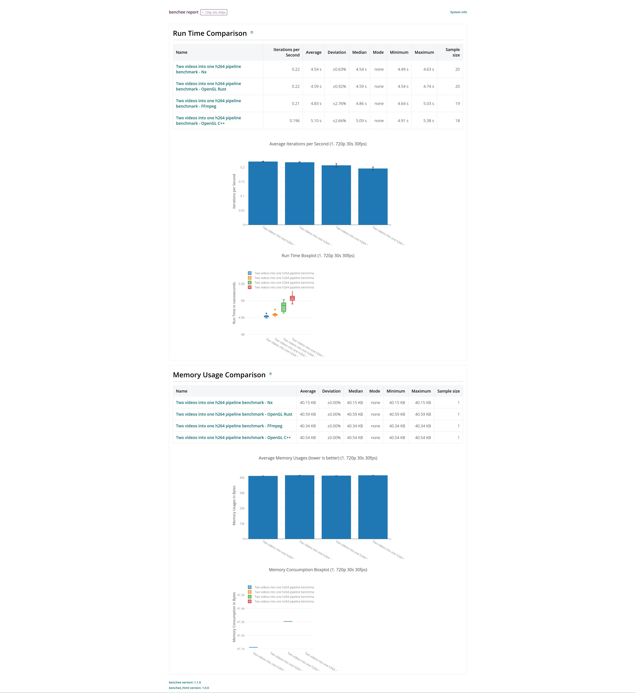 | 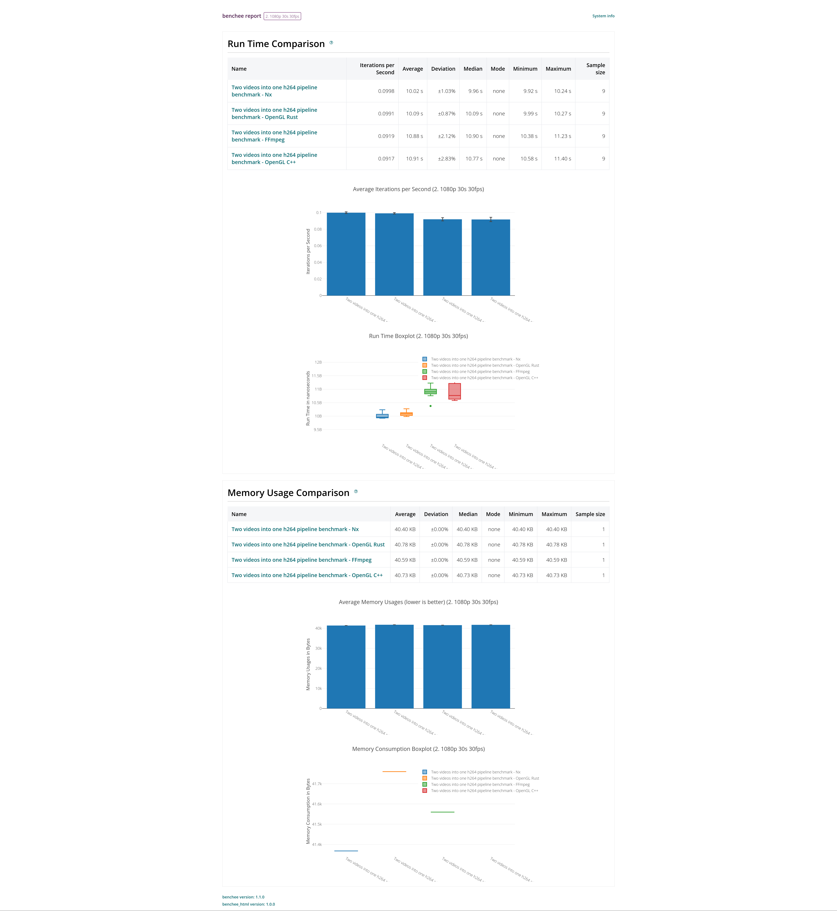

<h3 align="center"> Benchee raw pipeline results: </h3>

720p                       |  1080p
:-------------------------:|:-------------------------:
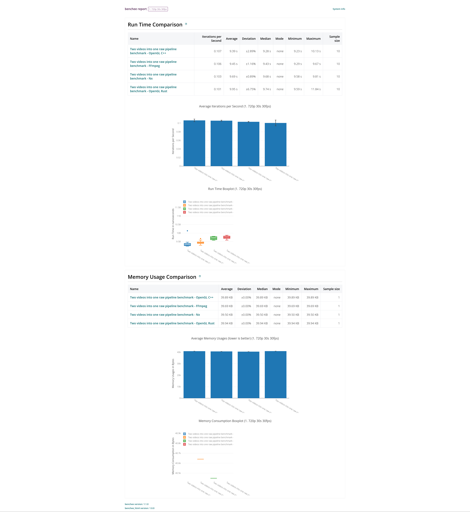 | 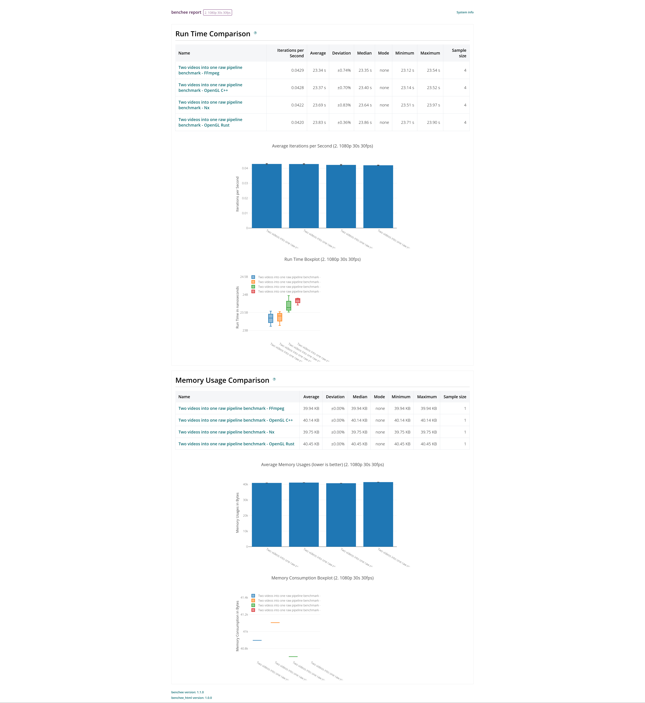

### MacBook Pro i5-1038NG7, 16GB RAM, Intel Iris Plus Graphics 1536 MB

<h3 align="center"> Benchee merge two frames results: </h3>

720p                       |  1080p                    |  4k
:-------------------------:|:-------------------------:|:-------------------------:
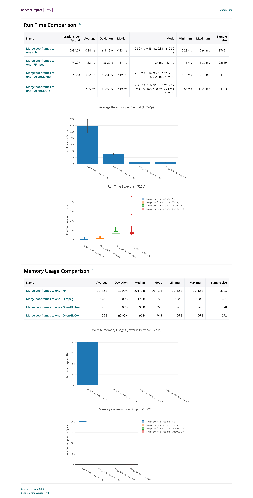 | 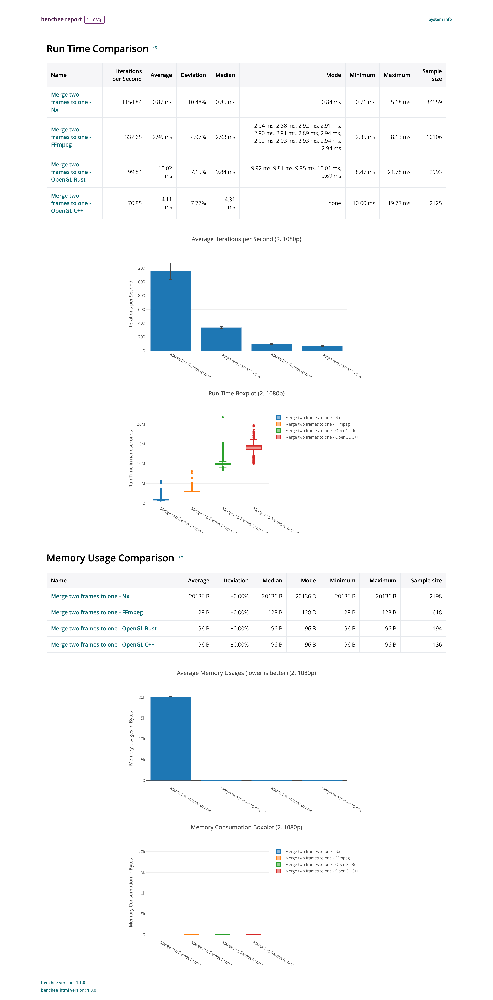 | 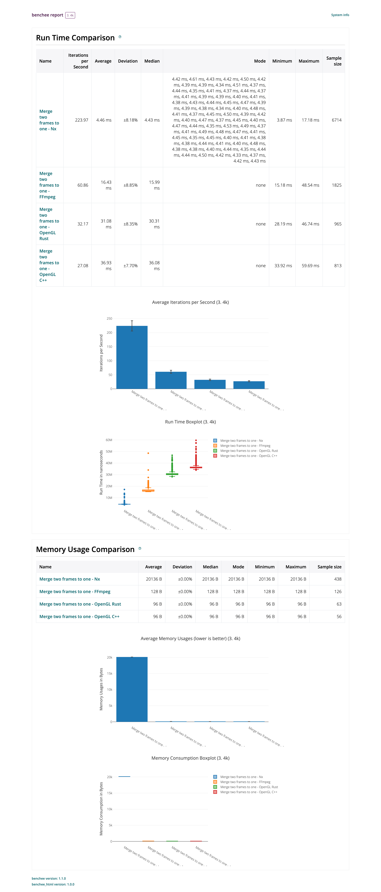

<h3 align="center"> Benchee h264 pipeline results: </h3>

720p                       |  1080p
:-------------------------:|:-------------------------:
 | 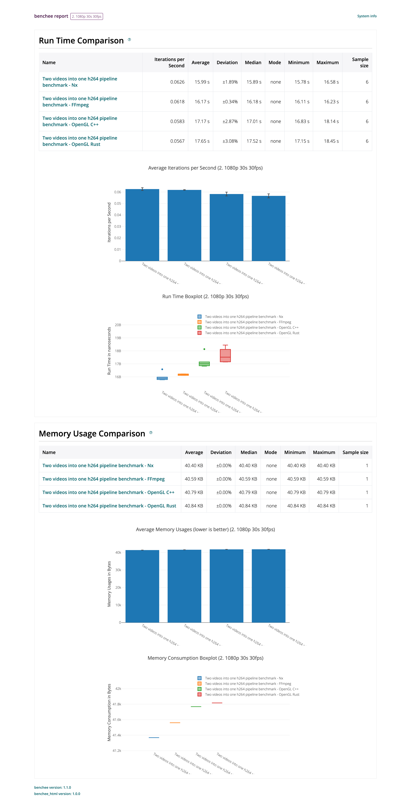

<h3 align="center"> Benchee raw pipeline results: </h3>

720p                       |  1080p
:-------------------------:|:-------------------------:
 | 

